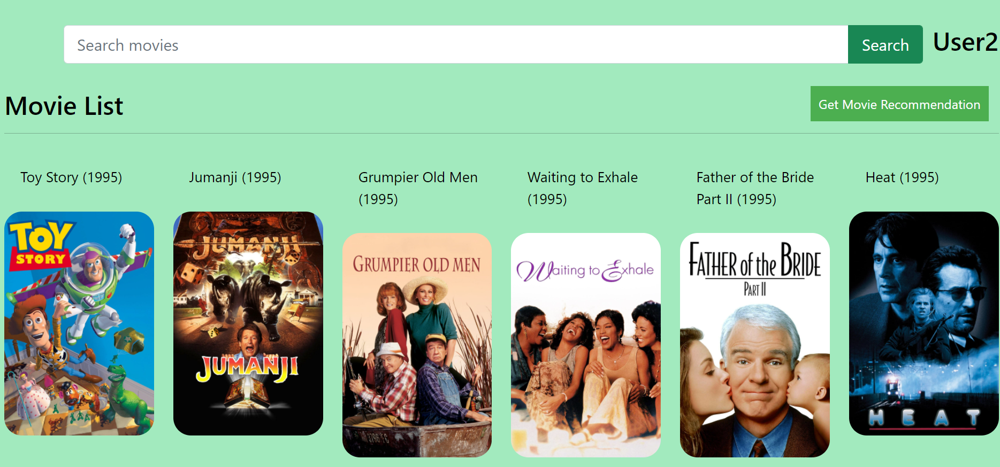
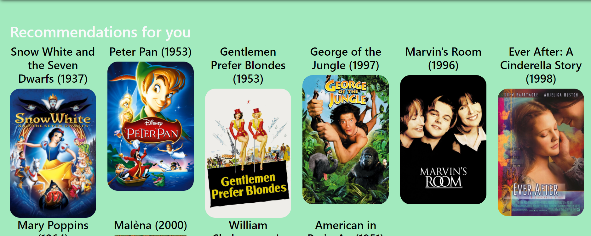

<h1 align="center">Microsoft Engage 2022
  
</h1>

<h2 align="center">Movie Mania: A Movie Recommendation System based on Collaborative Filtering </h2>

 <!-- TABLE OF CONTENTS -->

  
Index

  <ol>
    <li>
      <a href="#about">About</a>
      <ul>
        <li><a href="#problem-statement">Problem Statement</a></li>
        <li><a href="#compatible-devices">Compatible devices</a></li>
        <li><a href="#tech-stack">Tech Stack</a></li>
      </ul>
    </li>
    <li>
      <a href="#algorithms">Algorithms for reccomending</a>
      <ul>
        <li><a href="#collaborative-filtering">Collaborative Filtering</a></li>
        <li><a href="#pearson-correlation">Pearson Correlation:USP of the project</a></li>
      </ul>
    </li>
    <li>
      <a href="#user-manual">User Manual</a>
      <ul>
        <li><a href="#set-up-virtual-environment">Set up virtual environment</a></li>
        <li><a href="#installation">Installation</a></li>
      </ul>
    </li>
    <li><a href="#a-look-at-the-app">A look at the app</a></li><ul>
        <li><a href="#login">Login</a></li>
        <li><a href="#home-page">Home Page</a></li>
        <li><a href="#get-recommendations">Get Recommendations</a></li>
      </ul>
    <li><a href="#future-scope-of-improvement">Future Scope for improvement</a></li>
    
  </ol>

<!-- ABOUT THE PROJECT -->

## About
* It is a movie recommender system that makes recommendations based on the user's ratings of other movies, as well as the combined ratings of all users who have registered.
*  A user can register, log in, rate movies, receive suggestions, and add movies to their Watchlist. 
*  The tmbd database, accessed through the tmbd API, can be used to look up information on a movie's cast and crew. 
*  This project was created for Microsoft Engage 2022's Algorithm challenge.

### Problem Statement
Showcase via your application the various types of algorithms that a web-streaming app (like Netflix) or an audio-streaming app (like Spotify) may use for their Recommendation Engine.

### Compatible Devices
PC,Laptop,Desktop.

### Tech Stack  
1.Front-end: HTML, CSS, Bootstrap, JavaScript
2. Back-end: Django

<!-- DIFFERENT RECOMMENDATION ENGINE -->

# Algorithms 

The different types of filterings are Collaborative Filtering (CF), Content–Based Filtering (CBF) and Demographic Filtering (DF). Let us discuss about Collaborative Filtering.

## Collaborative Filtering
There are 2 main types of memory-based collaborative filtering algorithms:
| User-User                                                                                                                                                         | Item-Item                                                                                                                         |
|-------------------------------------------------------------------------------------------------------------------------------------------------------------------|-----------------------------------------------------------------------------------------------------------------------------------|
| The "nearest neighbour" approach for recommendations examines users' rating patterns and discovers "neighbours," or users with ratings that are similar to yours. | Item-based collaborative filtering, unlike user-based collaborative filtering, considers the similarity between distinct objects. |
| . The system then proceeds to provide recommendations based on these neighbours' ratings.                                                                         | Users who got item X will now be recommended item Y, and vice versa.                                                              |

### Pearson Correlation
In the project ,I have userd user-user collaborative filtering using pearson coorelation. I have used the pivot table and correlation coefficient to recommend movies here. If the user likes a particular movie, it takes that movie’s columns and find the correlation of that column with all the other movie columns and get the movies that highly correlate with the chosen movie.

<!-- INSTALLATIONS -->

## User Manual
To install and run the project on your local system, clone this repo to your local machine and open command prompt and go to that path:

### Set up virtual environment
>py -m venv venv
>[project path]/activate.bat

### Installation
sh
  pip install -r requirements.txt

* To run it on the local host-

To separately run the application on your local host,run the following command:

sh
  Python manage.py runserver

<!-- APP TUTORIAL-->
## a look at the app
### Login 
Registered Users can login into their account using the username and password and can start rating the movies and then get recommendations.

 
### Home Page
This page displays all the movies and users can click on the movie and give ratings and add them to list or can see the cast and crew of the movie. 

### Get Recommendations
Registered users will get some recommendations based on the rating given by them by clicking on the button 'Get Recommendation' to get some recommendations.

## Future Scope of improvement
The project can be further improved by implementing SVD matrix factorization algorithm for better reccomendations. This algorithm distributes registered users and movies in a matrix, the movies of a specific genre that are rated equally by multiple users are reccomended back to them.
